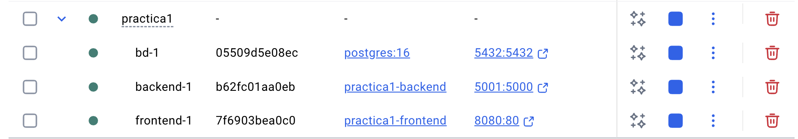

# Práctica 1 - Sistema de Gestión de Citas Médicas

**Alumnos:**
- Amanda María Aroutin Allocca
- Eduardo Sebastian Lukacs Sandru

**Fecha:** 2 de noviembre de 2025

---

Este proyecto consiste en una aplicación web para la gestión de citas médicas, implementada con Docker Compose y compuesta por tres contenedores: frontend (Nginx), backend (Flask) y base de datos (PostgreSQL).

## Cómo levantar el entorno

### Prerrequisitos
- Docker
- Docker Compose

### Pasos para iniciar la aplicación

1. **Clonar o navegar al directorio del proyecto:**
   ```bash
   cd "Practica 1"
   ```

2. **Construir y levantar todos los contenedores:**
   ```bash
   docker-compose up --build
   ```
   
   O para ejecutar en segundo plano:
   ```bash
   docker-compose up --build -d
   ```

3. **Verificar que los contenedores están ejecutándose:**
   ```bash
   docker-compose ps
   ```

### URLs de acceso
- **Frontend (Nginx)**: http://localhost:8080
- **Backend (Flask)**: http://localhost:5001
- **API de citas**: http://localhost:5001/api/citas (requiere autenticación)

## Pruebas básicas para verificar la integración de los tres contenedores

### 1. Prueba del Frontend (Contenedor Nginx)
- **Acceder a**: http://localhost:8080
- **Verificar**: Que se muestra la página de login/registro
- **Resultado esperado**: Página web con formularios de inicio de sesión y registro

### 2. Prueba de la Base de Datos (Contenedor PostgreSQL)
- **Registrar un nuevo usuario** desde http://localhost:8080
- **Datos de prueba**:
  - Nombre: Test User
  - Edad: 25
  - Email: test@example.com
  - Contraseña: test123
- **Resultado esperado**: Mensaje "Registro exitoso. Tu ID es: [número]"

### 3. Prueba del Backend (Contenedor Flask)
- **Iniciar sesión** con el usuario recién creado
- **Verificar dashboard**: http://localhost:5001/dashboard (o desde el frontend)
- **Crear una cita nueva** con los siguientes datos:
  - Fecha: (fecha futura)
  - Hora: 10:30 a.m.
  - Motivo: Consulta de prueba
- **Resultado esperado**: Cita creada exitosamente

### 4. Prueba de la API JSON (Integración completa)
- **Después de crear citas, acceder a**: http://localhost:5001/api/citas
- **Resultado esperado**: JSON con las citas del usuario logueado
  ```json
  [
    {
      "fecha": "2025-10-15",
      "hora": "10:30:00",
      "motivo": "Consulta de prueba",
      "id": 1
    }
  ]
  ```

### 5. Verificación de conectividad entre contenedores
- **Frontend → Backend**: Los formularios del frontend comunican con el backend
- **Backend → Base de datos**: Los datos se almacenan y recuperan correctamente
- **Flujo completo**: Registro → Login → Crear cita → Ver citas en JSON

## Comandos que usamos

### Detener la aplicación:
```bash
docker-compose down
```

### Ver logs de los contenedores:
```bash
docker-compose logs
docker-compose logs backend
docker-compose logs frontend
docker-compose logs bd
```

### Reconstruir sin caché:
```bash
docker-compose build --no-cache
docker-compose up --build
```

## Estructura que sigue nuestro proyecto
```
Practica 1/
├── docker-compose.yml
├── README.md
├── backend/
│   ├── app.py
│   ├── Dockerfile
│   └── requirements.txt
├── bd/
│   └── init.sql
└── frontend/
    ├── Dockerfile
    ├── nginx.conf
    ├── static/
    └── templates/
```

## Creación de los contenedores

### 1. Contenedor de Base de Datos (PostgreSQL)

**Configuración en docker-compose.yml:**
```yaml
bd:
  image: postgres:16
  environment:
    POSTGRES_USER: postgres
    POSTGRES_PASSWORD: postgres
    POSTGRES_DB: DMN-pec1
  volumes:
    - ./bd/init.sql:/docker-entrypoint-initdb.d/init.sql
  ports:
    - "5432:5432"
```

**Características:**
- **Imagen base**: PostgreSQL 16 oficial de Docker Hub
- **Base de datos**: DMN-pec1 (creada automáticamente)
- **Credenciales**: postgres/postgres
- **Inicialización**: Script SQL automático desde `./bd/init.sql`
- **Puerto expuesto**: 5432 (estándar PostgreSQL)

### 2. Contenedor Backend (Flask)

**Dockerfile del backend:**
```dockerfile
FROM python:3.9-slim
WORKDIR /app
COPY requirements.txt .
RUN pip install -r requirements.txt
COPY . .
EXPOSE 5000
CMD ["python", "app.py"]
```

**Configuración en docker-compose.yml:**
```yaml
backend:
  build: ./backend
  depends_on:
    - bd
  environment:
    DB_HOST: bd
    DB_NAME: DMN-pec1
    DB_USER: postgres
    DB_PASSWORD: postgres
    DB_PORT: 5432
  ports:
    - "5001:5000"
  volumes:
    - ./frontend:/frontend
```

**Características:**
- **Imagen base**: Python 3.9-slim
- **Framework**: Flask para la API REST
- **Dependencias**: Especificadas en requirements.txt (Flask, psycopg2, etc.)
- **Puerto interno**: 5000 (Flask)
- **Puerto expuesto**: 5001 (mapeado desde host)
- **Conexión BD**: Variables de entorno para conectar a PostgreSQL

### 3. Contenedor Frontend (Nginx)

**Dockerfile del frontend:**
```dockerfile
FROM nginx:alpine
COPY nginx.conf /etc/nginx/conf.d/default.conf
EXPOSE 80
```

**Configuración en docker-compose.yml:**
```yaml
frontend:
  build: ./frontend
  depends_on:
    - backend
  ports:
    - "8080:80"
```

**Características:**
- **Imagen base**: Nginx Alpine (ligera)
- **Archivos estáticos**: CSS, HTML templates
- **Configuración**: nginx.conf personalizada
- **Puerto interno**: 80 (HTTP estándar)
- **Puerto expuesto**: 8080 (acceso desde host)
- **Proxy**: Redirige peticiones API al backend

## Estado actual de los contenedores

Según la captura proporcionada, los tres contenedores están ejecutándose correctamente:



### Verificación de conectividad

Los contenedores se comunican a través de la red interna de Docker Compose:
- **Frontend** → **Backend**: Peticiones HTTP/API
- **Backend** → **Base de datos**: Conexión PostgreSQL mediante psycopg2
- **Red Docker**: Todos los contenedores en la misma red `practica1_default`


